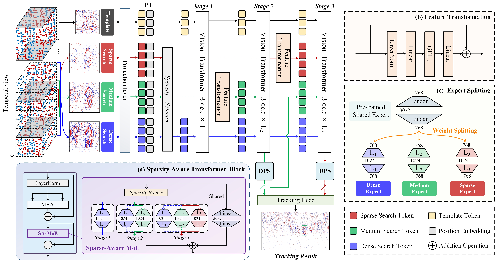

# 🔎 PSMTrack
**Dynamic Pondering Sparsity-aware Mixture-of-Experts Transformer for Event Stream based Visual Object Tracking** [[Paper](https://arxiv.org/abs/2605.06112)]

Shiao Wang, Xiao Wang*, Duoqing Yang, Wenhao Zhang, Bo Jiang*, Lin Zhu, Yonghong Tian, Bin Luo


# :dart: Abstract 
Despite significant progress, RGB-based trackers remain vulnerable to challenging imaging conditions, such as low illumination and fast motion. Event cameras offer a promising alternative by asynchronously capturing pixel-wise brightness changes, providing high dynamic range and high temporal resolution. 
However, existing event-based trackers often neglect the intrinsic spatial sparsity and temporal density of event data, while relying on a single fixed temporal-window sampling strategy that is suboptimal under varying motion dynamics. 
In this paper, we propose an event sparsity-aware tracking framework that explicitly models event-density variations across multiple temporal scales. Specifically, the proposed framework progressively injects sparse, medium-density, and dense event search regions into a three-stage Vision Transformer backbone, enabling hierarchical multi-density feature learning. Furthermore, we introduce a sparsity-aware Mixture-of-Experts module to encourage expert specialization under different sparsity patterns, and design a dynamic pondering strategy to adaptively adjust the inference depth according to tracking difficulty. 
Extensive experiments on FE240hz, COESOT, and EventVOT demonstrate that the proposed approach achieves a favorable trade-off between tracking accuracy and computational efficiency.

### Framework 

<p align="center">
  
</p>

The overall framework of the proposed Dynamic \textbf{P}ondering \textbf{S}parsity-aware \textbf{M}ixture-of-Experts Transformer for event-based tracking, termed PSMTrack. According to different temporal window lengths, sparse, medium-density, and dense event representations are jointly fed into a hierarchical backbone network for progressive feature learning. Specifically, we introduce a sparsity-aware Mixture-of-Experts (MoE) module into the first block of each stage to replace the standard feed-forward network, enabling specialized modeling of feature representations with different sparsity levels. In addition, we propose a dynamic pondering strategy to adaptively determine whether to terminate inference early, thereby improving overall tracking efficiency.


# :collision: Update Log 


# :hammer: Environment 

Install env
```
conda create -n psmtrack python=3.10
conda activate psmtrack
pip install -r requirements.txt
```

You can also modify paths by editing these two files
```
lib/train/admin/local.py  # paths about training
lib/test/evaluation/local.py  # paths about testing
```

Download pretrained model [[mae_pretrain_ep0300.pth.tar](https://pan.baidu.com/s/187w8ejD4VZZBz6buPKMTQA?pwd=AHUE)] and put it under `$/pretrained_models` for training.

Download the trained model weight from [[APMTrack_ep0050.pth](https://pan.baidu.com/s/1jeNPb3Xod_4X0lshTQlSBg?pwd=AHUE)] and put it under `$/output/checkpoints/train/apmtrack/apmtrack_coesot` for testing directly.

**Tracking Results on the COESOT dataset**

[[Tracking Results](https://pan.baidu.com/s/1C4TF4SXM6AORrNDifbbY9w?pwd=AHUE)]

## Train & Test
```
# train
bash train.sh

# test
bash test.sh
```


# :chart_with_upwards_trend: Benchmark Results
The overall performance evaluation on the EventVOT dataset.

<p align="left">
  
</p>


# :cupid: Acknowledgement 
* Thanks for the  [OSTrack](https://github.com/botaoye/OSTrack), [PyTracking](https://github.com/visionml/pytracking), and [ViT](https://github.com/rwightman/pytorch-image-models) library for a quickly implement.

# :newspaper: Citation 
```bibtex
@misc{wang2026dynamicponderingsparsityawaremixtureofexperts,
      title={Dynamic Pondering Sparsity-aware Mixture-of-Experts Transformer for Event Stream based Visual Object Tracking}, 
      author={Shiao Wang and Xiao Wang and Duoqing Yang and Wenhao Zhang and Bo Jiang and Lin Zhu and Yonghong Tian and Bin Luo},
      year={2026},
      eprint={2605.06112},
      archivePrefix={arXiv},
      primaryClass={cs.CV},
}
```


