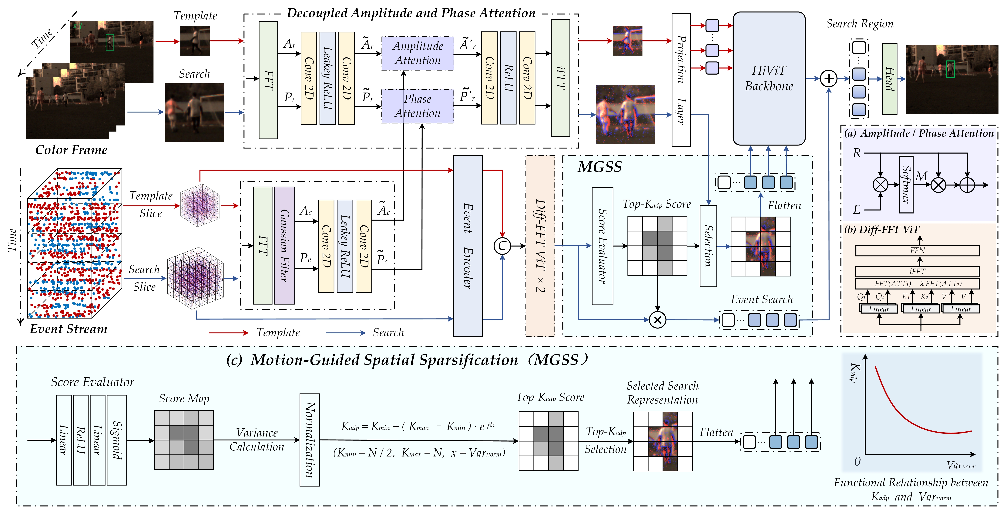

# OpenEvTracking

## **Works maintained in this GitHub** 

:dart: **Decoupling Amplitude and Phase Attention in Frequency Domain for RGB-Event based Visual Object Tracking**, Shiao Wang, Xiao Wang*, Haonan Zhao, Jiarui Xu, Bo Jiang*, Lin Zhu, Xin Zhao, Yonghong Tian, Jin Tang, arXiv:2601.01022 
[[Paper](https://arxiv.org/abs/2601.01022)] 

Existing RGB–Event visual object tracking approaches primarily rely on conventional feature-level fusion, failing to fully exploit the unique advantages of event cameras. In particular, the high dynamic range and motion-sensitive nature of event cameras are often overlooked, while low-information regions are processed uniformly, leading to unnecessary computational overhead for the backbone network. To address these issues, we propose a novel tracking framework that performs early fusion in the frequency domain, enabling effective aggregation of high-frequency information from the event modality. Specifically, RGB and event modalities are transformed from the spatial domain to the frequency domain via the Fast Fourier Transform, with their amplitude and phase components decoupled. High-frequency event information is selectively fused into RGB modality through amplitude and phase attention, enhancing feature representation while substantially reducing backbone computation. In addition, a motion-guided spatial sparsification module leverages the motion-sensitive nature of event cameras to capture the relationship between target motion cues and spatial probability distribution, filtering out low-information regions and enhancing target-relevant features. Finally, a sparse set of target-relevant features is fed into the backbone network for learning, and the tracking head predicts the final target position. Extensive experiments on three widely used RGB–Event tracking benchmark datasets, including FE108, FELT, and COESOT, demonstrate the high performance and efficiency of our method.

  

 

:dart: **Spatial Orthogonal Refinement for Robust RGB-Event Visual Object Tracking**, 
Dexing Huang, Shiao Wang, Fan Zhang, Xiao Wang*, arXiv:2603.27913, ICAIS and ISAS, 2026, 本科生科研训练 
[[Paper](https://arxiv.org/abs/2603.27913)] 

Robust visual object tracking (VOT) remains challenging in high-speed motion scenarios, where conventional RGB sensors suffer from severe motion blur and performance degradation. Event cameras, with microsecond temporal resolution and high dynamic range, provide complementary structural cues that can potentially compensate for these limitations. However, existing RGB-Event fusion methods typically treat event data as dense intensity representations and adopt black-box fusion strategies, failing to explicitly leverage the directional geometric priors inherently encoded in event streams to rectify degraded RGB features. To address this limitation, we propose SOR-Track, a streamlined framework for robust RGB-Event tracking based on Spatial Orthogonal Refinement (SOR). The core SOR module employs a set of orthogonal directional filters that are dynamically guided by local motion orientations to extract sharp and motion-consistent structural responses from event streams. These responses serve as geometric anchors to modulate and refine aliased RGB textures through an asymmetric structural modulation mechanism, thereby explicitly bridging structural discrepancies between two modalities. Extensive experiments on the large-scale FE108 benchmark demonstrate that SOR-Track consistently outperforms existing fusion-based trackers, particularly under motion blur and low-light conditions. Despite its simplicity, the proposed method offers a principled and physics-grounded approach to multi-modal feature alignment and texture rectification.

  

 

